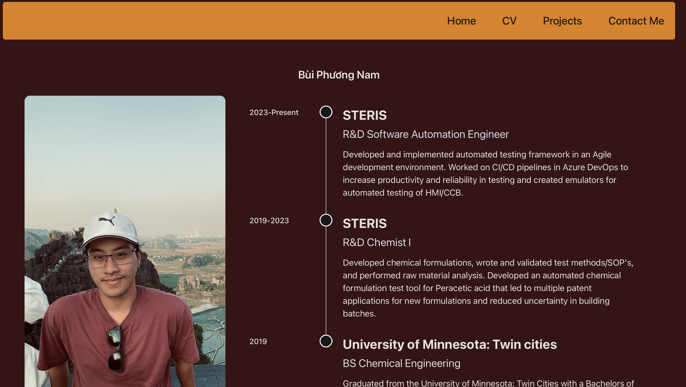
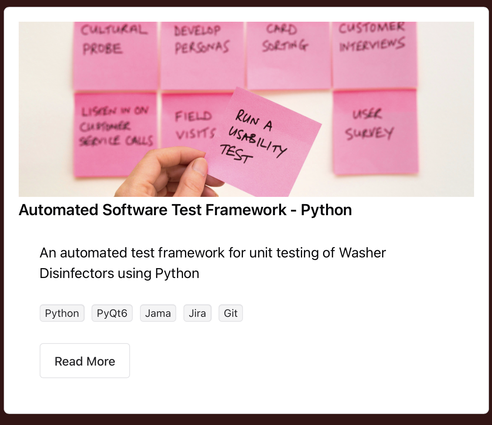

<a id="readme-top"></a>


<!-- PROJECT SHIELDS -->
<!--
*** I'm using markdown "reference style" links for readability.
*** Reference links are enclosed in brackets [ ] instead of parentheses ( ).
*** See the bottom of this document for the declaration of the reference variables
*** for contributors-url, forks-url, etc. This is an optional, concise syntax you may use.
*** https://www.markdownguide.org/basic-syntax/#reference-style-links
-->
[![Contributors][contributors-shield]][contributors-url]
[![Forks][forks-shield]][forks-url]
[![Stargazers][stars-shield]][stars-url]
[![Issues][issues-shield]][issues-url]
[![MIT License][license-shield]][license-url]
[![LinkedIn][linkedin-shield]][linkedin-url]


<!-- PROJECT LOGO -->
<br />
<div align="center">

<h3 align="center">Nam Bui's Porfolio</h3>

  <p align="center">
    This project uses Typescript React and Chakra-UI with a backend written in GO for a portfolio website, containing Nam Bui's projects and Resume.
    <br />
    <a href="https://github.com/nambui17/nam-bui-portfolio"><strong>Explore the docs »</strong></a>
    <br />
    <br />
  </p>
</div>


<!-- TABLE OF CONTENTS -->
<details>
  <summary>Table of Contents</summary>
  <ol>
    <li>
      <a href="#about-the-project">About The Project</a>
      <ul>
        <li><a href="#built-with">Built With</a></li>
      </ul>
    </li>
    <li>
      <a href="#getting-started">Getting Started</a>
      <ul>
        <li><a href="#prerequisites">Prerequisites</a></li>
        <li><a href="#installation">Installation</a></li>
      </ul>
    </li>
    <li><a href="#usage">Usage</a></li>
    <li><a href="#roadmap">Roadmap</a></li>
    <li><a href="#contributing">Contributing</a></li>
    <li><a href="#license">License</a></li>
    <li><a href="#contact">Contact</a></li>
    <li><a href="#acknowledgments">Acknowledgments</a></li>
  </ol>
</details>


<!-- ABOUT THE PROJECT -->
## About The Project



<p align="right">(<a href="#readme-top">back to top</a>)</p>


### Built With

* [![React][React.js]][React-url]
* [![Vite][Vite.tsx]][Vite-url]
* [![Go][Golang]][Go-url]
* [![Vercel][Vercel]][Vercel-url]

<p align="right">(<a href="#readme-top">back to top</a>)</p>


<!-- GETTING STARTED -->
## Getting Started

This is an example of how you may give instructions on setting up your project locally.
To get a local copy up and running follow these simple example steps.

### Prerequisites

N/A
* npm
  ```sh
  npm install npm@latest -g
  ```

### Installation

1. Get a free API Key at [https://example.com](https://example.com)
2. Clone the repo
   ```sh
   git clone https://github.com/nambui17/nam-bui-portfolio.git
   ```
3. Install NPM packages
   ```sh
   npm install
   ```
5. Change git remote url to avoid accidental pushes to base project
   ```sh
   git remote set-url origin nambui17/nam-bui-portfolio
   git remote -v # confirm the changes
   ```

<p align="right">(<a href="#readme-top">back to top</a>)</p>


<!-- USAGE EXAMPLES -->
## Usage

View my projects my clicking on the Projects link at the top of the screen in the navigation bar.



<p align="right">(<a href="#readme-top">back to top</a>)</p>


<!-- ROADMAP -->
## Roadmap

- N/A

See the [open issues](https://github.com/nambui17/nam-bui-portfolio/issues) for a full list of proposed features (and known issues).

<p align="right">(<a href="#readme-top">back to top</a>)</p>


<!-- CONTRIBUTING -->
## Contributing

Contributions are what make the open source community such an amazing place to learn, inspire, and create. Any contributions you make are **greatly appreciated**.

If you have a suggestion that would make this better, please fork the repo and create a pull request. You can also simply open an issue with the tag "enhancement".
Don't forget to give the project a star! Thanks again!

1. Fork the Project
2. Create your Feature Branch (`git checkout -b feature/AmazingFeature`)
3. Commit your Changes (`git commit -m 'Add some AmazingFeature'`)
4. Push to the Branch (`git push origin feature/AmazingFeature`)
5. Open a Pull Request

<p align="right">(<a href="#readme-top">back to top</a>)</p>

### Top contributors:

<a href="https://github.com/nambui17/nam-bui-portfolio/graphs/contributors">
  
</a>


<!-- LICENSE -->
## License

Distributed under the MIT License. See `LICENSE.txt` for more information.

<p align="right">(<a href="#readme-top">back to top</a>)</p>


<!-- CONTACT -->
## Contact

Nam Bui - nam.bui17@icloud.com - +1(612)860-5784

Project Link: [Nam's Portfolio](https://nam-bui-portfolio.vercel.app)

<p align="right">(<a href="#readme-top">back to top</a>)</p>


<!-- ACKNOWLEDGMENTS -->
## Acknowledgments

* [Best README Template](https://github.com/othneildrew/Best-README-Template/pull/73)

<p align="right">(<a href="#readme-top">back to top</a>)</p>


<!-- MARKDOWN LINKS & IMAGES -->
<!-- https://www.markdownguide.org/basic-syntax/#reference-style-links -->
[contributors-shield]: https://img.shields.io/github/contributors/nambui17/nam-bui-portfolio.svg?style=for-the-badge
[contributors-url]: https://github.com/nambui17/nam-bui-portfolio/graphs/contributors
[forks-shield]: https://img.shields.io/github/forks/nambui17/nam-bui-portfolio.svg?style=for-the-badge
[forks-url]: https://github.com/nambui17/nam-bui-portfolio/network/members
[stars-shield]: https://img.shields.io/github/stars/nambui17/nam-bui-portfolio.svg?style=for-the-badge
[stars-url]: https://github.com/nambui17/nam-bui-portfolio/stargazers
[issues-shield]: https://img.shields.io/github/issues/nambui17/nam-bui-portfolio.svg?style=for-the-badge
[issues-url]: https://github.com/nambui17/nam-bui-portfolio/issues
[license-shield]: https://img.shields.io/github/license/nambui17/nam-bui-portfolio.svg?style=for-the-badge
[license-url]: https://github.com/nambui17/nam-bui-portfolio/blob/master/LICENSE.txt
[linkedin-shield]: https://img.shields.io/badge/-LinkedIn-black.svg?style=for-the-badge&logo=linkedin&colorB=555
[linkedin-url]: https://linkedin.com/in/nambui17
[Vite.tsx]: https://img.shields.io/badge/Vite-646CFF?style=for-the-badge&logo=Vite&logoColor=white
[Vite-url]: https://vite.dev
[Golang]: https://img.shields.io/badge/Go-00ADD8?logo=Go&logoColor=white&style=for-the-badge
[Go-url]: https://go.dev
[resume-screenshot]: assets/Resume-screenshot.png
[React.js]: https://img.shields.io/badge/React-20232A?style=for-the-badge&logo=react&logoColor=61DAFB
[React-url]: https://reactjs.org/
[Vercel]: https://img.shields.io/badge/Vercel-000000?style=for-the-badge&logo=vercel&logoColor=white
[Vercel-url]: https://vercel.com/docs
